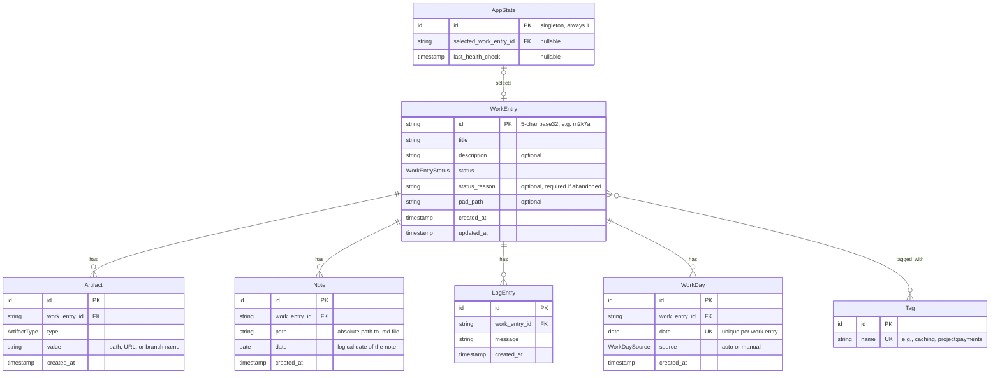
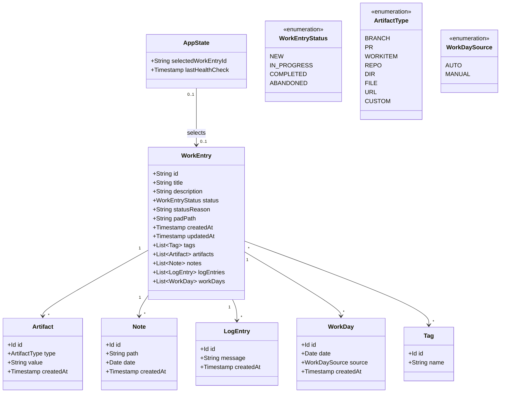

# Orbit — Data Model

> **Status:** Draft  
> **Last updated:** 2026-02-10

This document describes orbit's data model conceptually. For the full product vision, goals, and CLI design, see [DESIGN.md](DESIGN.md). Implementation details (language, libraries, specific SQL syntax) are intentionally omitted.

---

## Overview

Orbit persists its data in a local relational database. The data model consists of:

| Entity | Description |
|--------|-------------|
| **WorkEntry** | The central entity representing a piece of work |
| **Tag** | Free-form labels (including `project:*` convention for projects) |
| **Artifact** | Linked references to branches, repos, files, or URLs |
| **Note** | Dated references to user-managed markdown files |
| **LogEntry** | Timestamped one-liner observations |
| **WorkDay** | A date on which work occurred (auto or manual) |
| **AppState** | Application state (selected entry, health check timestamp) |

---

## Design Principles

1. **Short sortable IDs:** WorkEntry uses 5-character base32 IDs (e.g., `m2k7a`) that encode a time prefix so newer entries sort after older ones. See [ID Generation](#id-generation). Other entities use opaque auto-generated identifiers not exposed to users.

2. **Timestamps:** All timestamps use ISO8601 format (`2026-02-10T14:32:00Z`) for unambiguous sorting and display.

3. **Dates:** Logical dates (for notes, work days) use `YYYY-MM-DD` format.

4. **Cascade deletes:** Deleting a WorkEntry removes all associated records (artifacts, notes, logs, work days, tag links).

5. **Paths are references:** File/folder paths are stored as absolute strings. Orbit tracks them but does not own or manage the underlying files.

6. **Projects are tags:** No separate project entity — projects use the tag convention `project:<name>`.

---

## Entity-Relationship Diagram



---

## Domain Model (Class Diagram)



---

## Entity Details

### WorkEntry

The central entity. Represents a unit of work: a feature, bug, spike, or learning.

| Field | Type | Required | Description |
|-------|------|----------|-------------|
| id | string | yes | Short sortable identifier (e.g., `m2k7a`) |
| title | string | yes | Short descriptive title |
| description | string | no | Longer explanation of what this work is about |
| status | WorkEntryStatus | yes | Current lifecycle status (default: `NEW`) |
| status_reason | string | no | Explanation for status (required when `ABANDONED`) |
| pad_path | string | no | Path to folder for experimental/scratch work ("pad") |
| created_at | timestamp | yes | When the entry was created |
| updated_at | timestamp | yes | When the entry was last modified |

**Status Lifecycle:**
- `NEW` → Just created, not started
- `IN_PROGRESS` → Actively being worked on
- `PAUSED` → Started but temporarily on hold
- `COMPLETED` → Done
- `ABANDONED` → Dropped (reason required)

Transitions follow the rank `NEW < {IN_PROGRESS, PAUSED} < {COMPLETED, ABANDONED}`.
`IN_PROGRESS` and `PAUSED` share a rank (pausing and resuming are lateral
moves), as do the two terminal states. Every transition is allowed, but
moving backward along this rank (e.g. `COMPLETED → IN_PROGRESS`) is advisory
only and prints a warning rather than being blocked.

The `status_reason` belongs to the status it explains, so it is rewritten on
every transition: it is **required when moving to `ABANDONED`**, optional for
the other statuses, and supplying an empty reason clears any previously stored
one.

### Tag

A free-form label attached to work entries.

| Field | Type | Required | Description |
|-------|------|----------|-------------|
| id | id | yes | Opaque identifier |
| name | string | yes | Unique tag name (e.g., `caching`, `project:payments`) |

**Conventions:**

| Prefix | Meaning | Cardinality |
|--------|---------|-------------|
| `project:*` | Which project this belongs to | Multiple allowed |
| `owner:*` | Context that owns this work (work, personal, etc.) | Single |

These are just tags in the database — the application layer enforces cardinality and provides ergonomic commands.

### Artifact

A reference to something linked to a work entry.

| Field | Type | Required | Description |
|-------|------|----------|-------------|
| id | id | yes | Opaque identifier |
| work_entry_id | string | yes | Parent work entry |
| type | ArtifactType | yes | What kind of artifact |
| value | string | yes | The actual reference (path, URL, branch name) |
| created_at | timestamp | yes | When linked |

**Artifact Types:**
- `BRANCH` — Git branch name
- `PR` — Pull request URL
- `WORKITEM` — Issue or work item URL (ADO, GitHub Issues, etc.)
- `REPO` — Path to a local git repository
- `DIR` — Path to a local directory (non-repo: docs folders, design assets, etc.)
- `FILE` — Path to a local file (e.g., `.code-workspace`, a single doc)
- `URL` — Any other URL (documentation, wiki, etc.)
- `CUSTOM` — User-defined freeform reference

### Note

A dated reference to a markdown file managed by the user.

| Field | Type | Required | Description |
|-------|------|----------|-------------|
| id | id | yes | Opaque identifier |
| work_entry_id | string | yes | Parent work entry |
| path | string | yes | Absolute path to the markdown file |
| date | date | yes | Logical date of the note (e.g., when written) |
| created_at | timestamp | yes | When linked in orbit |

**Note:** Orbit does not own or create these files — it only tracks references to files the user manages elsewhere (Obsidian vault, project folder, etc.).

### LogEntry

A timestamped one-liner captured from the terminal.

| Field | Type | Required | Description |
|-------|------|----------|-------------|
| id | id | yes | Opaque identifier |
| work_entry_id | string | yes | Parent work entry |
| message | string | yes | The log message |
| created_at | timestamp | yes | When captured |

**Purpose:** Lightweight observations captured in the moment without switching to a notes app. Useful for timeline reconstruction and search.

### WorkDay

A record that work happened on a particular date.

| Field | Type | Required | Description |
|-------|------|----------|-------------|
| id | id | yes | Opaque identifier |
| work_entry_id | string | yes | Parent work entry |
| date | date | yes | The date (unique per work entry) |
| source | WorkDaySource | yes | How it was recorded |
| created_at | timestamp | yes | When recorded |

**Sources:**
- `AUTO` — Inferred from activity (log entry added, artifact linked, etc.)
- `MANUAL` — Explicitly marked by user (`orbit work today`)

**Constraint:** One record per work entry per date.

### AppState

Singleton application state.

| Field | Type | Required | Description |
|-------|------|----------|-------------|
| selected_work_entry_id | string | no | Currently selected work entry (or null) |
| last_health_check | timestamp | no | When orbit last checked for stale references |

---

## ID Generation

WorkEntry IDs are 5-character strings using Crockford base32 (digits +
lowercase letters, skipping the visually ambiguous `i`, `l`, `o`, `u`).
Each character encodes 5 bits, so the full ID is **25 bits**, split as:

| Bits | Component | Purpose |
|---|---|---|
| 15 | **time prefix** | hours since the epoch — newer entries sort after older ones |
| 10 | **random suffix** | disambiguates entries created in the same hour |

The alphabet is: `0123456789abcdefghjkmnpqrstvwxyz`.

The epoch is **2026-01-01T00:00:00Z**. The 15-bit time field wraps after
about 3.7 years, after which strict chronological sort is no longer
guaranteed across the wrap boundary (still strictly sortable *within*
any single 3.7-year window). When that becomes a real concern, the ID
length can be extended to 6 characters by prepending a `0` to existing
IDs without breaking anything.

The 10 random bits give 1024 distinct IDs per hour bucket, which is
orders of magnitude more than a personal user will create in an hour
— collision risk is negligible for the intended use.

Example IDs (illustrative, chronological):

```
m2k7a   (today, 11am)
m2k9q   (today, 11am, another entry)
m2kqr   (today, 12pm)
m2nb3   (tomorrow)
```

Random bits are sourced from `math/rand/v2` (non-cryptographic; fine
for personal IDs). Other entities (Tag, Artifact, Note, LogEntry,
WorkDay) use opaque auto-incrementing integer IDs not exposed to users.

---

## Constraints Summary

| Constraint | Description |
|------------|-------------|
| WorkEntry.id | Unique, 5-char Crockford base32 |
| Tag.name | Unique |
| WorkDay(work_entry_id, date) | Unique together — one day per entry |
| AppState | Singleton — exactly one row |
| Cascade delete | Deleting WorkEntry removes all children |
| Status reason | Required when status is `ABANDONED` |
